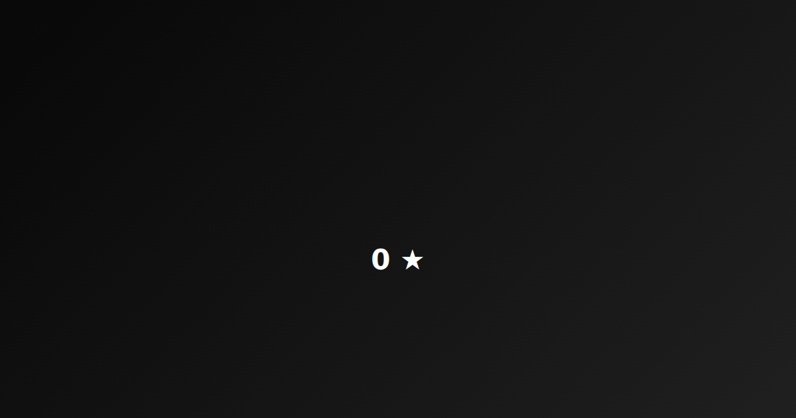

# LiveOG

**Bring Open Graph to life.**

LiveOG renders animated social preview cards from React components. You write one card, LiveOG captures it frame by frame in a headless browser and exports a static PNG fallback plus MP4 and GIF versions.

[](https://github.com/Julezbeyer/liveog/actions/workflows/ci.yml)
[](https://www.npmjs.com/package/@liveog/cli)
[](LICENSE)
[](CONTRIBUTING.md)

<p align="center">
  
</p>

<p align="center"><sub>Rendered by <code>liveog render</code> from <a href="examples/basic/src/main.tsx">examples/basic</a>. The static fallback is <a href="docs/demo.png">docs/demo.png</a>.</sub></p>

## Try it in your browser

**[julezbeyer.github.io/liveog](https://julezbeyer.github.io/liveog/)** — pick a template, add your text and logo, download PNG, GIF and MP4. Everything renders client-side, nothing is uploaded. The playground lives in [`apps/web`](apps/web) and is built with `@liveog/react` itself.

## Why

Open Graph previews are still static images. Some platforms play MP4 or GIF previews, most do not, and every one of them needs a static fallback. LiveOG gives you a deterministic timeline so a single card definition produces all three outputs, and it never pretends a platform supports motion when it does not.

See the [platform compatibility table](docs/compatibility.md) for the current
verification status.

## Quick start

Prerequisites: Node 20+, [FFmpeg](https://ffmpeg.org/download.html) on your PATH.

```bash
npm install @liveog/react
npx @liveog/cli render http://localhost:5173 ./dist
```

While it works you get a progress bar, and at the end the meta tags to paste:

```text
✔ Browser ready
✔ Frames captured
✔ Encoded

  Rendered 120 frames in 9.7s → dist/
    og.png               72.3 KB
    og.mp4               65.9 KB
    og.gif              258.7 KB

  Paste into your <head>:

    <meta property="og:image" content="og.png" />
    ...
```

Add `--verbose` to see FFmpeg's own output, or `--no-progress` for plain log lines. Progress is disabled automatically when the output is not a terminal, so CI logs stay readable.

Output:

```text
dist/
├── og.png                 # static fallback, last frame of the animation
├── og.mp4                 # H.264, faststart, ready for og:video
├── og.gif                 # palette-encoded, roughly 300 KB for a 4s card
└── liveog.manifest.json   # sizes, asset list and ready-to-paste meta tags
```

Options:

```text
liveog render [url] [outDir] [options]

  --width <px>        Card width (default 1200)
  --height <px>       Card height (default 630)
  --duration <ms>     Animation length (default 4000)
  --fps <n>           Frames per second (default 30)
  --formats <list>    Comma separated subset of png,mp4,gif
  --poster <ms>       Timeline position for the PNG (default: end)
  --browser <path>    Chromium binary instead of the Playwright download
  --base-url <url>    Public URL prefix used in the manifest and meta tags
  --no-manifest       Skip writing liveog.manifest.json
  --config <path>     Config file to load (default: liveog.config.ts in cwd)
  --no-config         Ignore any config file
```

The first run of the renderer downloads Chromium through Playwright. Point `--browser` or `LIVEOG_BROWSER_PATH` at an existing Chromium to skip that. FFmpeg is checked before any frames are captured, so a missing install fails in a second rather than after a full render.

## Config file

Drop a `liveog.config.ts` (or `.mjs`) next to your project and run `liveog render` with no arguments. Command line flags override the file:

```ts
import type { LiveOGFileConfig } from '@liveog/cli/config'

export default {
  url: 'http://localhost:5173',
  outDir: './dist',
  duration: 3000,
  formats: ['png', 'mp4'],
  baseUrl: 'https://example.com/og',
} satisfies LiveOGFileConfig
```

TypeScript configs need Node 22.6+ or a loader like tsx; a `liveog.config.mjs` works on any supported Node.

## Manifest and meta tags

Every render writes `liveog.manifest.json` describing what was produced:

```json
{
  "version": 1,
  "width": 1200,
  "height": 630,
  "duration": 4000,
  "fps": 30,
  "posterTime": 3967,
  "assets": [
    { "format": "png", "file": "og.png", "url": "https://example.com/og/og.png", "type": "image/png", "bytes": 74036 }
  ],
  "meta": ["<meta property=\"og:image\" content=\"https://example.com/og/og.png\" />"]
}
```

The `meta` array is printed after each render and can be pasted straight into your `<head>`. `og:image` always points at the PNG, because every platform needs a static fallback. The GIF is never advertised as `og:image`: platforms that accept it show only the first frame, which looks worse than the poster.

## Writing a card

```tsx
import { LiveCard, Animate, Counter } from '@liveog/react'

export function Card() {
  return (
    <LiveCard width={1200} height={630} duration={4000}>
      <Animate from="bottom" duration={700}>
        <h1>LiveOG</h1>
      </Animate>
      <Counter from={0} to={12842} suffix=" stars" delay={700} easing="easeOutExpo" />
    </LiveCard>
  )
}
```

The renderer drives the animation by dispatching a `liveog:time` event with the current timeline position in milliseconds. Components pick that up on their own, so a card is just a function of time — which makes renders deterministic and reproducible in CI.

Driving the timeline yourself (for a scrubber or a custom preview) is opt-in:

```tsx
import { LiveOGTimeProvider, useLiveOGTime } from '@liveog/react'

<LiveOGTimeProvider value={time}>
  <Card />
</LiveOGTimeProvider>
```

Inside a provider `useLiveOGTime()` returns that value; outside one it subscribes to `liveog:time` itself.

### Timing and easing

`Animate` and `Counter` share the same timing props, so elements can be staggered on one timeline:

| Prop | Default | What it does |
| --- | --- | --- |
| `duration` | `700` / `1800` | Length of the segment in ms |
| `delay` | `0` | Milliseconds to wait before the segment starts |
| `easing` | `'easeOutCubic'` | Built-in curve name or a custom `(t: number) => number` |

`Animate` additionally takes `from` (`bottom`, `top`, `left`, `right`) and `distance` in pixels. `Counter` takes `format` to control how the value is rendered:

```tsx
<Counter to={12842} format={v => `${(v / 1000).toFixed(1)}k`} />
```

Built-in easings: `linear`, `easeInQuad`, `easeOutQuad`, `easeInOutQuad`, `easeInCubic`, `easeOutCubic`, `easeInOutCubic`, `easeOutBack`, `easeOutExpo`. Every curve is anchored so `f(0) === 0` and `f(1) === 1`, which keeps the poster frame showing the finished card.

## Examples

[`examples/basic`](examples/basic) is the minimal card used by CI. [`examples/github-stats`](examples/github-stats) fetches a repository from the GitHub API and animates its stars, forks and open issues:

```bash
pnpm dev:github-stats
pnpm render "http://localhost:5174/?repo=Julezbeyer/liveog" ./dist
```

Change `?repo=owner/name` to point it at any public repository. It uses the unauthenticated API (60 requests per hour) and renders nothing until the fetch settles, so the renderer's `networkidle` wait never captures a loading state.

## Packages

| Package | What it does |
| --- | --- |
| [`@liveog/react`](packages/react) | `LiveCard`, `Animate`, `Counter` and the time provider |
| [`@liveog/core`](packages/core) | Framework-free timeline helpers and defaults |
| [`@liveog/renderer`](packages/renderer) | Playwright capture and FFmpeg encoding as a library |
| [`@liveog/cli`](packages/cli) | The `liveog render` command |
| [`apps/web`](apps/web) | The browser playground, deployed to GitHub Pages |

## Status

Published on npm as of v0.2.0. Still pre-1.0: the API surface is intentionally small and will change. See the [roadmap](ROADMAP.md) for what is planned and the [open issues](https://github.com/Julezbeyer/liveog/issues) for where help is wanted.

## Contributing

Issues labelled [`good first issue`](https://github.com/Julezbeyer/liveog/issues?q=is%3Aissue+is%3Aopen+label%3A%22good+first+issue%22) are scoped to be done in an evening. Platform compatibility reports are just as valuable as code: LiveOG only claims motion support that someone has verified.

Read [CONTRIBUTING.md](CONTRIBUTING.md) for the development setup.

## License

[MIT](LICENSE)
