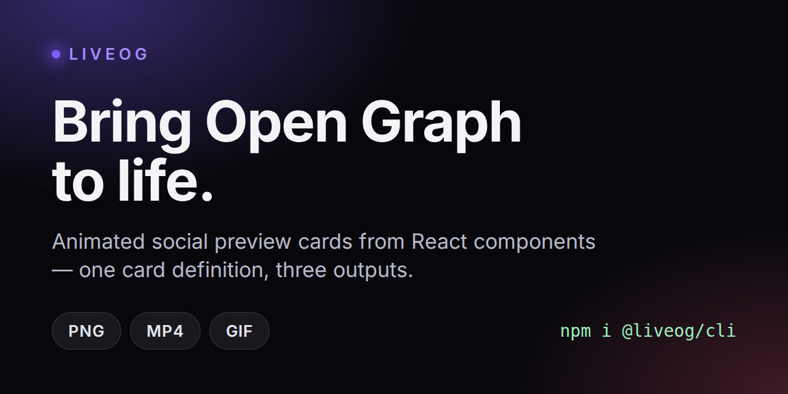

# Social preview card

The card LiveOG uses for its own GitHub social preview, rendered with LiveOG.



Rendered output lives in [`docs/social-preview/`](../../docs/social-preview/):
`og.png`, `og.mp4`, `og.gif` and a `liveog.manifest.json`.

## Re-rendering

```bash
pnpm build                      # the example imports the workspace packages
pnpm dev:social-preview         # serves the card on http://localhost:5175
```

Then, from the repository root, in a second shell:

```bash
node packages/cli/dist/index.js render http://localhost:5175 docs/social-preview \
  --width 1280 --height 640 --duration 4000 --fps 30 --no-config
```

`1280x640` is GitHub's recommended social preview size, which is why this card
does not use the `1200x630` default we use for Open Graph elsewhere.

## Uploading it to GitHub

GitHub has no API for the social preview image, so the PNG has to be uploaded by
hand once: **repository → Settings → General → Social preview → Edit → Upload an
image**, then pick `docs/social-preview/og.png`. It stays in place until someone
replaces it; re-rendering the file alone does not update GitHub.

GitHub serves a still image there, so the last frame has to read as a finished
card on its own — every element lands well before the timeline ends.

## Note on padding

The root element uses `boxSizing: 'border-box'`. With the default `content-box`,
`height: '100%'` plus vertical padding makes the content taller than the card,
and `LiveCard` clips the overflow — the bottom row disappears from the render
without any warning.
